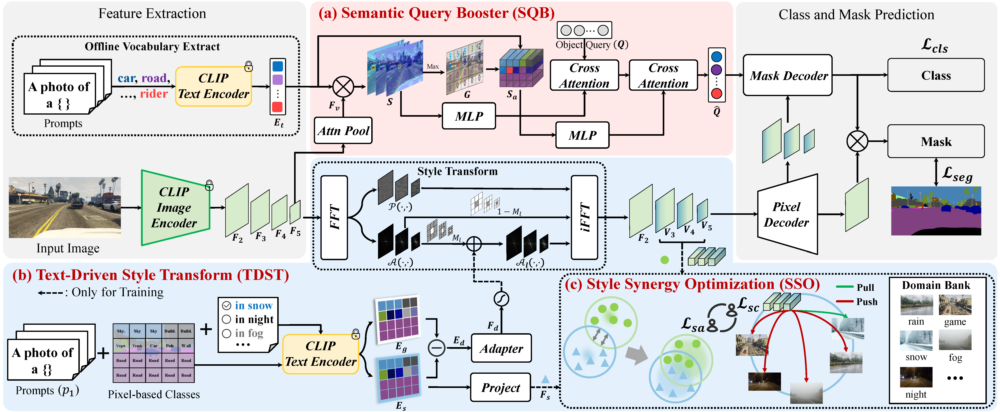

<div align="center">
<h1>🎉 SCSD (Accepted by AAAI 2025)</h1>
<h3>Exploring Semantic Consistency and Style Diversity for Domain Generalized Semantic Segmentation</h3>

[Hongwei Niu](https://github.com/nhw649), Linhuang Xie, [Jianghang Lin](https://github.com/HunterJ-Lin), Shengchuan Zhang

Xiamen University


[[`Paper`]()] [[`Demo`]()] [[`BibTeX`](#citation)]
</div>

---

## :bulb: Abstract

> *Domain Generalized Semantic Segmentation (DGSS) seeks to utilize source domain data exclusively to enhance the generalization of semantic segmentation across unknown target domains. Prevailing studies predominantly concentrate on feature normalization and domain randomization, these approaches exhibit significant limitations. Feature normalization-based methods tend to confuse semantic features in the process of constraining the feature space distribution, resulting in classification misjudgment. Domain randomization-based methods frequently incorporate domain-irrelevant noise due to the uncontrollability of style transformations, resulting in segmentation ambiguity. To address these challenges, we introduce a novel framework, named SCSD for Semantic Consistency prediction and Style Diversity generalization. It comprises three pivotal components: Firstly, a Semantic Query Booster is designed to enhance the semantic awareness and discrimination capabilities of object queries in the mask decoder, enabling cross-domain semantic consistency prediction. Secondly, we develop a Text-Driven Style Transform module that utilizes domain difference text embeddings to controllably guide the style transformation of image features, thereby increasing inter-domain style diversity. Lastly, to prevent the collapse of similar domain feature spaces, we introduce a Style Synergy Optimization mechanism that fortifies the separation of inter-domain features and the aggregation of intra-domain features by synergistically weighting style contrastive loss and style aggregation loss. Extensive experiments demonstrate that the proposed SCSD significantly outperforms existing state-of-theart methods. Notably, SCSD trained on GTAV achieved an average of 49.11 mIoU on the four unseen domain datasets, surpassing the previous state-of-the-art method by +4.08 mIoU.*
<div align="center">
    
</div><br/>

## :clipboard: Table of content
1. [:hammer_and_wrench: Installation](#installation)
2. [:dart: Model Zoo](#model_zoo)
3. [:toolbox: Usage](#usage)
    1. [Prepare Datasets](#prepare)
    2. [Training](#training)
    3. [Evaluation](#evaluation)
    4. [Inference](#inference)
4. [:mag: Citation](#citation)
5. [:scroll: License](#license)
6. [:sparkling_heart: Acknowledgement](#acknowledgement)

## :hammer_and_wrench: Installation <a name="installation"></a>
```bash
conda create --name scsd python=3.9 -y
conda activate scsd
pip install torch==1.12.1+cu113 torchvision==0.13.1+cu113 --extra-index-url https://download.pytorch.org/whl/cu113

pip install -U opencv-python
git clone git@github.com:facebookresearch/detectron2.git
python -m pip install -e detectron2
pip install git+https://github.com/mcordts/cityscapesScripts.git

git clone https://github.com/nhw649/SCSD.git
cd SCSD
pip install -r requirements.txt
cd scsd/modeling/pixel_decoder/ops
sh make.sh
```

## :dart: Model Zoo <a name="model_zoo"></a>
<table>
<caption>GTAV -> Others</caption>
<tbody>
<!-- START TABLE -->
<!-- TABLE HEADER -->
<th valign="bottom">Name</th>
<th valign="bottom">Backbone</th>
<th valign="bottom">Cityscapes</th>
<th valign="bottom">BDD</th>
<th valign="bottom">Mapillary</th>
<th valign="bottom">Synthia</th>
<th valign="bottom">Average</th>
<th valign="bottom">Download</th>
<!-- TABLE BODY -->
<!-- ROW: EOV-Seg (S) -->
<tr>
<td align="left">SCSD</a></td>
<td align="center">ResNet50</td>
<td align="center">51.72</td>
<td align="center">44.67</td>
<td align="center">56.98</td>
<td align="center">43.08</td>
<td align="center">49.11</td>
<td align="center"><a href="">ckpt</a>&nbsp;
</tr>
</tbody>
</table>

<table>
<caption>Open-vocabulary semantic segmentation</caption>
<tbody>
<!-- START TABLE -->
<!-- TABLE HEADER -->
<th valign="bottom">Name</th>
<th valign="bottom">Backbone</th>
<th valign="bottom">A-847</th>
<th valign="bottom">PC-459</th>
<th valign="bottom">A-150</th>
<th valign="bottom">PC-59</th>
<th valign="bottom">PAS-20</th>
<th valign="bottom">FPS</th>
<th valign="bottom">Download</th>
<!-- TABLE BODY -->
<!-- ROW: EOV-Seg (S) -->
<tr>
<td align="left">EOV-Seg (S)</a></td>
<td align="center">ResNet50</td>
<td align="center">6.6</td>
<td align="center">11.5</td>
<td align="center">21.9</td>
<td align="center">46.0</td>
<td align="center">87.2</td>
<td align="center">24.5</td>
<td align="center"><a href="https://drive.google.com/file/d/1UgLrRxpi4l30F8zTqhEv7cEW23TCGv3h/view?usp=drive_link">ckpt</a>&nbsp;
</tr>
<!-- ROW: EOV-Seg (M) -->
<tr>
<td align="left">EOV-Seg (M)</a></td>
<td align="center">ResNet50x4</td>
<td align="center">7.8</td>
<td align="center">12.2</td>
<td align="center">25.5</td>
<td align="center">51.8</td>
<td align="center">91.2</td>
<td align="center">18.9</td>
<td align="center"><a href="https://drive.google.com/file/d/1--SYgaWs8_Ry2ouXBJO8FfSWH7D-Pejk/view?usp=drive_link">ckpt</a>&nbsp;
</tr>

<!-- ROW: EOV-Seg (L) -->
<tr>
<td align="left">EOV-Seg (L)</a></td>
<td align="center">ConvNeXt-L</td>
<td align="center">12.8</td>
<td align="center">16.8</td>
<td align="center">32.1</td>
<td align="center">56.9</td>
<td align="center">94.8</td>
<td align="center">11.8</td>
<td align="center"><a href="https://drive.google.com/file/d/1dVfHpzmCOlV6hLfUpd3nHXz62wdB7RY2/view?usp=drive_link">ckpt</a>&nbsp;
</tr>

</tbody>
</table>

## :toolbox: Usage <a name="usage"></a> 
1. Please follow [this](datasets/README.md) to prepare datasets for training. The data should be organized like: <a name="prepare"></a>
```
datasets/
    acdc/
        gt/
        rgb_anon/
    bdd/
        images/
        labels/
    cityscapes/
        gtFine/
        leftImg8bit/
    gta/
        images/
        labels/
    mapillary/
        training/
        validation/
        testing/
        labels_detectron2/
    synthia/
        RGB/
        Depth/
        GT/
        labels_detectron2/
```

2. To train a model, use <a name="training"></a>

```bash
# Train on GTAV(G)
python train_net.py --num-gpus 2 --config-file configs/gtav/scsd_R50_bs2_20k.yaml
# Train on Cityscapes(C)
python train_net.py --num-gpus 2 --config-file configs/cityscapes/scsd_R50_bs2_20k.yaml
# Train on GTAV+Synthia(G+S)
python train_net.py --num-gpus 2 --config-file configs/gtav_synthia/scsd_R50_bs2_20k.yaml
```

3. To evaluate a model's performance, use <a name="evaluation"></a>

```bash
# G -> C, B, M, S
python train_net.py --config-file configs/gtav/scsd_R50_bs2_20k.yaml --eval-only MODEL.WEIGHTS /path/to/checkpoint_file
# C -> B, M, G, S
python train_net.py --config-file configs/cityscapes/scsd_R50_bs2_20k.yaml --eval-only MODEL.WEIGHTS /path/to/checkpoint_file
# G+S -> C, B, M
python train_net.py --config-file configs/gtav_synthia/scsd_R50_bs2_20k.yaml --eval-only MODEL.WEIGHTS /path/to/checkpoint_file
# G -> ACDC
python train_net.py --config-file configs/acdc/scsd_R50_bs2_20k.yaml --eval-only MODEL.WEIGHTS /path/to/checkpoint_file
```

4. Inference demo with pre-trained models, use <a name="inference"></a>
```bash
python demo/demo.py --config-file configs/gtav/scsd_R50_bs2_20k.yaml \
                    --input input_dir/ \
                    --output output_dir/ \
                    --opts MODEL.WEIGHTS /path/to/checkpoint_file
```

## :mag: Citation <a name="citation"></a>
```bibtex

```

## :scroll: License <a name="license"></a>
SCSD is released under the [Apache 2.0 license](LICENSE). Please refer to [LICENSE](LICENSE) for the careful check, if you are using our code for commercial matters.

## :sparkling_heart: Acknowledgement <a name="acknowledgement"></a> 
-   [Mask2Former](https://github.com/facebookresearch/Mask2Former)
-   [CLIP Surgery](https://github.com/xmed-lab/CLIP_Surgery)
-   [Detectron2](https://github.com/facebookresearch/detectron2)